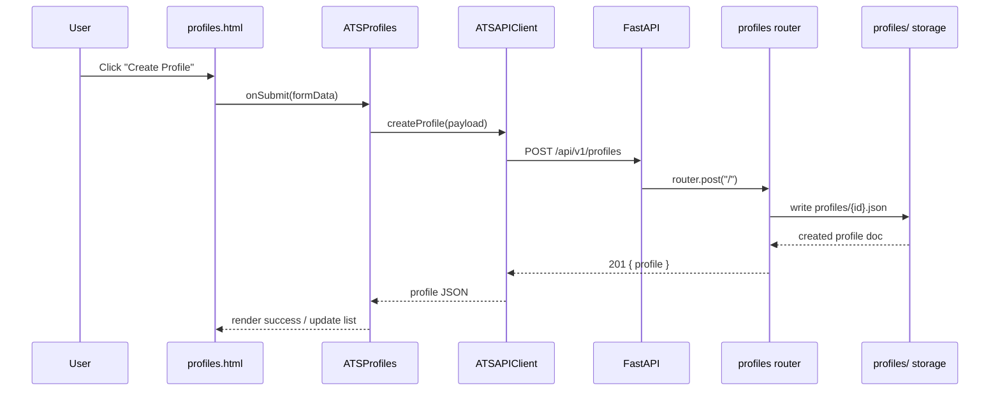
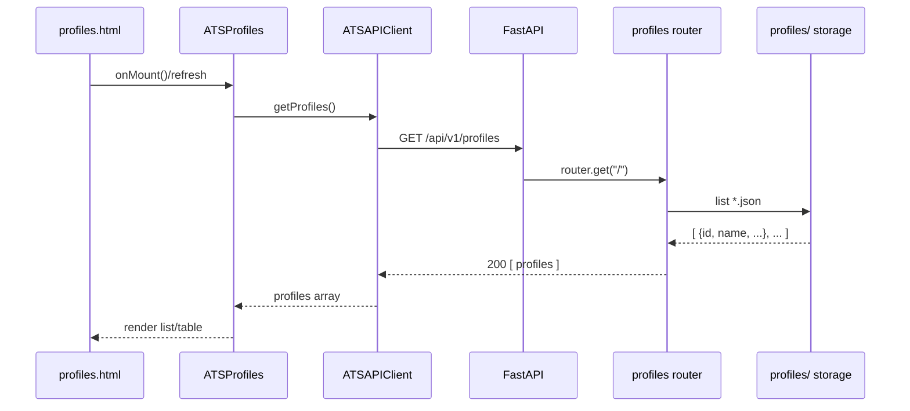
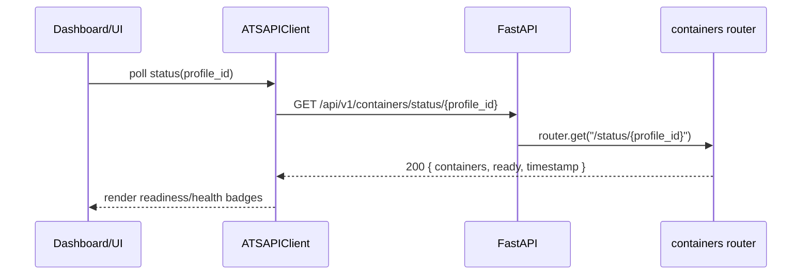
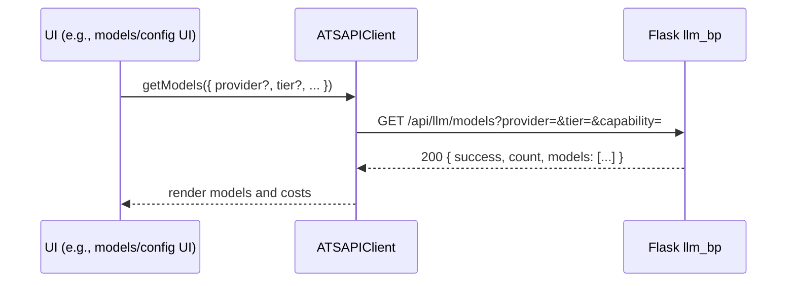

# API Interactions: UI ↔ Backend

Purpose: concise, visual reference for WHEN, WHY, and HOW the UI talks to backend APIs during core flows like agent/profile creation, listings, infra readiness checks, and LLM models catalog.

Primary UI layers: [index.html](ui/index.html), [profiles.html](ui/profiles.html)

Core client/controller: [ATSAPIClient](ui/js/api-client.js:6), [ATSProfiles](ui/js/profiles.js:6), [ATSApplication.config.apiBaseURL](ui/js/main.js:12)

Backend: FastAPI app [container_app_example.py](api/container_app_example.py:1) with routers [profile_endpoints.router](api/profile_endpoints.py:400), [container_endpoints.router](api/container_endpoints.py:114), [scenario_endpoints.py](api/scenario_endpoints.py:56), [sandbox_endpoints.py](api/sandbox_endpoints.py:19); Flask analytics blueprint [llm_bp](api/llm_endpoints.py:19). Persistence: [profiles/](profiles/)


## System Overview

```mermaid
graph TD
  subgraph Browser/UI
    UI1[index.html]
    UI2[profiles.html]
  end

  subgraph JS/Controllers
    APP[ATSApplication]
    PRO[ATSProfiles]
    API[ATSAPIClient]
  end

  subgraph API (FastAPI)
    APPF[container_app_example.py (FastAPI app)]
    RPRO[profiles router]
    RCON[containers router]
    RSCN[scenarios router]
    RSBX[sandbox router]
  end

  subgraph Analytics (Flask)
    LLM[llm_bp (Flask) /api/llm]
  end

  subgraph Storage
    PFS[(profiles/)]
  end

  UI1 --> APP
  UI2 --> PRO --> API
  APP -. set baseURL .-> API
  API -->|/api/v1/profiles| RPRO
  API -->|/api/v1/containers| RCON
  API -->|/api/v1/scenarios| RSCN
  API -->|/api/v1/sandbox| RS BX
  RPRO --> PFS
  API -->|/api/llm/*| LLM
  APPF --- RPRO
  APPF --- RCON
  APPF --- RSCN
  APPF --- RS BX
```

References:
- Client: [ATSAPIClient](ui/js/api-client.js:6)
- App config + runtime override: [ATSApplication.config.apiBaseURL](ui/js/main.js:12), override occurs in [ATSApplication.loadConfiguration()](ui/js/main.js:64) (sets `window.atsAPI.baseURL` at [ui/js/main.js:84](ui/js/main.js:84))
- Routers: [profile_endpoints.router](api/profile_endpoints.py:400), [container_endpoints.router](api/container_endpoints.py:114), [scenario_endpoints.py](api/scenario_endpoints.py:56), [sandbox_endpoints.py](api/sandbox_endpoints.py:19)
- Analytics (Flask): [llm_bp.route('/models')](api/llm_endpoints.py:51)
- Persistence: [profiles/](profiles/)


## Flows

### A) Create Profile (agent)



- WHEN: user submits the Create form in [profiles.html](ui/profiles.html).
- WHY: persist a new agent configuration for later activation and training runs.
- HOW:
  - Client method: [ATSAPIClient.createProfile()](ui/js/api-client.js:133)
  - Endpoint: POST /api/v1/profiles
    - Handler: [@router.post('/'), create_profile](api/profile_endpoints.py:478)
    - Storage: [profiles/{id}.json](profiles/)
  - Body (example):
    ```json
    {
      "name": "Operator X",
      "type": "red_team",
      "description": "Pen tester",
      "skill_level": "intermediate",
      "specialization": "lateral movement",
      "configuration": { "llm_model": "openai/gpt-4o-mini" }
    }
    ```
  - Returns: 201 Created with profile { id, status: "inactive", created_at, updated_at, ... }


### B) List Profiles



- WHEN: profiles page loads or user refreshes.
- WHY: show existing agents for selection, activation, edits.
- HOW:
  - Client method: [ATSAPIClient.getProfiles()](ui/js/api-client.js:125)
  - Endpoint: GET /api/v1/profiles
    - Handler: [@router.get('/'), list_profiles](api/profile_endpoints.py:404)
  - Returns (example):
    ```json
    [
      { "id": "uuid-1", "name": "Operator X", "type": "red_team", "status": "inactive" },
      { "id": "uuid-2", "name": "Blue Watch", "type": "blue_team", "status": "active" }
    ]
    ```


### C) Container Status (infra readiness)



- WHEN: after invoking preparation flows or when entering a dashboard card for a profile; periodic polling during startup.
- WHY: ensure dependent infra (e.g., kali/proxy containers) is running and healthy before tasks.
- HOW:
  - Endpoint: GET /api/v1/containers/status/{profile_id}
    - Handler: [@router.get('/status/{profile_id}')](api/container_endpoints.py:169)
  - Response (example):
    ```json
    {
      "profile_id": "uuid-1",
      "ready": false,
      "containers": {
        "kali":   { "status": "running", "healthy": true,  "pool": "hot" },
        "proxy":  { "status": "starting","healthy": false, "pool": "warm" }
      },
      "timestamp": "2025-10-19T02:30:00Z"
    }
    ```


### D) LLM Models List (analytics integration)



- WHEN: user opens LLM management/config or analytics views that require available models.
- WHY: present model options with costs/capabilities for budget-aware selection.
- HOW:
  - Client method: [ATSAPIClient.getModels()](ui/js/api-client.js:386)
  - Endpoint: GET /api/llm/models
    - Handler: [llm_bp.route('/models', methods=['GET'])](api/llm_endpoints.py:51)
  - Returns (example):
    ```json
    {
      "success": true,
      "count": 2,
      "models": [
        { "provider": "openai", "name": "gpt-4o-mini", "cost_per_1k": 0.15, "capabilities": ["CHAT","TOOLS"] },
        { "provider": "anthropic", "name": "claude-3-haiku", "cost_per_1k": 0.25, "capabilities": ["CHAT"] }
      ]
    }
    ```

Note: The LLM API is served by Flask under `/api/llm` ([llm_bp](api/llm_endpoints.py:19)). The UI client currently prefixes requests with the base URL; ensure routing/proxy aligns so `/api/llm/*` is reachable from the browser.


## Configuration and Base URLs

- Default client base URL: constructor default in [ATSAPIClient](ui/js/api-client.js:7) is `'/api/v1'`.
- Runtime override: [ATSApplication.config.apiBaseURL](ui/js/main.js:12) defaults to `http://localhost:8000/api/v1` and is applied at startup in [loadConfiguration()](ui/js/main.js:64), setting `window.atsAPI.baseURL = this.config.apiBaseURL` at [ui/js/main.js:84](ui/js/main.js:84).
- Implication: UI requests go to `http://localhost:8000/api/v1/*` unless the config is changed. Non-v1 analytics endpoints (e.g., `/api/llm/models`) must be reachable as configured by your server/proxy.


## CORS and Local Dev

- The FastAPI application example [container_app_example.py](api/container_app_example.py:1) configures permissive CORS for local development, allowing browser pages (e.g., [index.html](ui/index.html), [profiles.html](ui/profiles.html)) to call the API without cross-origin errors during development.
